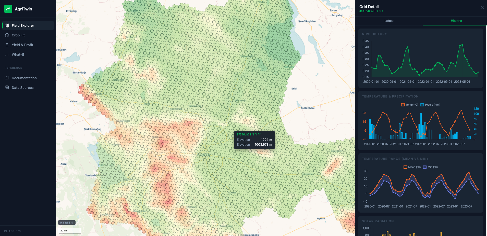

# agriTwin-app

The web application layer of [AgriTwin](https://github.com/ridvanzengin/agritwin) — an agricultural digital twin for Konya Province, Turkey. Serves an interactive MapLibre map with crop suitability scoring, what-if scenario simulation, and yield & profit projections.



**[Live Demo →](http://agritwin.online)**

## Features

- **Field Explorer** — H3 hexagonal grid map at three zoom levels; click any cell to inspect elevation, NDVI, soil, and climate timeseries
- **Crop Fit** — per-cell suitability scores for 8 crops with monthly climate-vs-requirement charts
- **Yield & Profit** — estimated yield and net profit choropleth; per-cell cost breakdown
- **What-If Scenarios** — draw a polygon, apply environmental overrides, and compare re-scored cells side-by-side with baseline via async Celery worker

## Tech Stack

Python · Flask · SQLAlchemy · MapLibre GL JS · Chart.js · Celery · Redis · Gunicorn · Docker

## Local Setup

Requires Docker and Docker Compose. The build context is the monorepo root, so `agriTwin-app/` and `agriTwin-etl/` must be siblings under the same parent directory.

```bash
# Clone all three repos first
git clone https://github.com/ridvanzengin/agritwin
git clone https://github.com/ridvanzengin/agriTwin-app  agritwin/agriTwin-app
git clone https://github.com/ridvanzengin/agriTwin-etl  agritwin/agriTwin-etl

cd agritwin/agriTwin-app
cp .env.example .env          # set FLASK_SECRET_KEY
docker compose up --build -d
```

This starts six services in dependency order:

| Service | What it does |
|---|---|
| `db` | PostgreSQL + PostGIS + TimescaleDB on port 5433 |
| `redis` | Redis 7 — Celery broker + result backend |
| `migrate` | Applies both Alembic chains (ETL + app), then exits |
| `web` | Flask app on port 5001 |
| `celery_worker` | Processes scenario scoring tasks asynchronously |
| `loader` | Bulk-loads Parquet data and seeds demo scenarios, then exits |

Flask is available at **http://localhost:5001** while the loader runs in the background (~5–10 min).

```bash
docker compose logs -f loader   # watch data load progress
```

## Running Tests

```bash
docker compose up -d db
pip install -e ".[dev]"
pytest
```

## Related

- [`agriTwin-etl`](https://github.com/ridvanzengin/agriTwin-etl) — ETL pipeline that populates the database this app reads from
- [`agritwin`](https://github.com/ridvanzengin/agritwin) — monorepo root with deployment scripts

## License

MIT — see [LICENSE](LICENSE)
